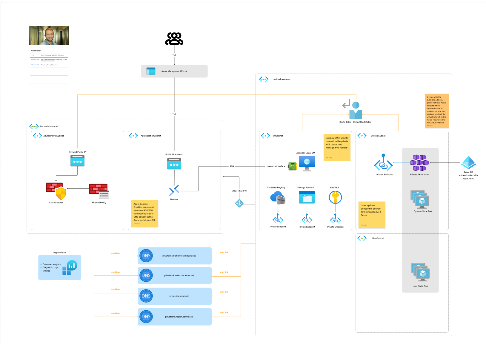
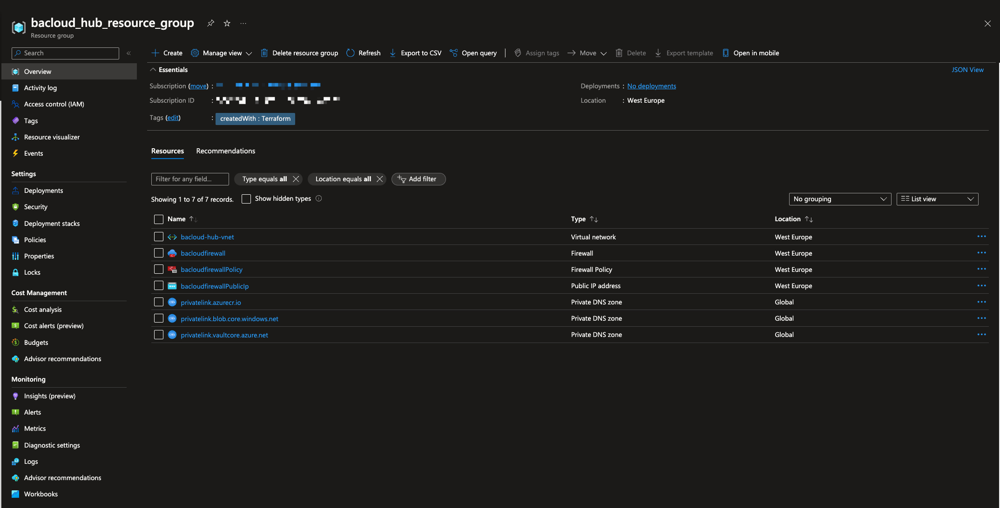
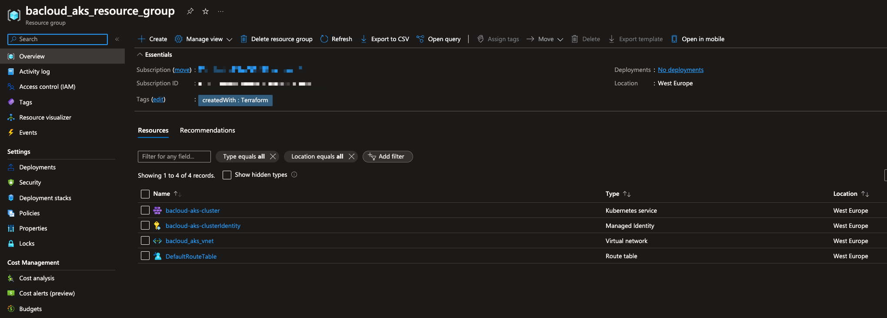
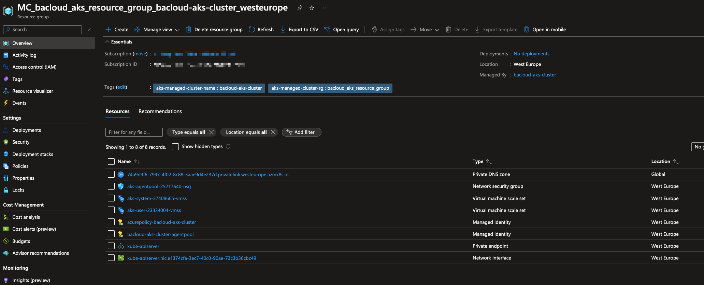
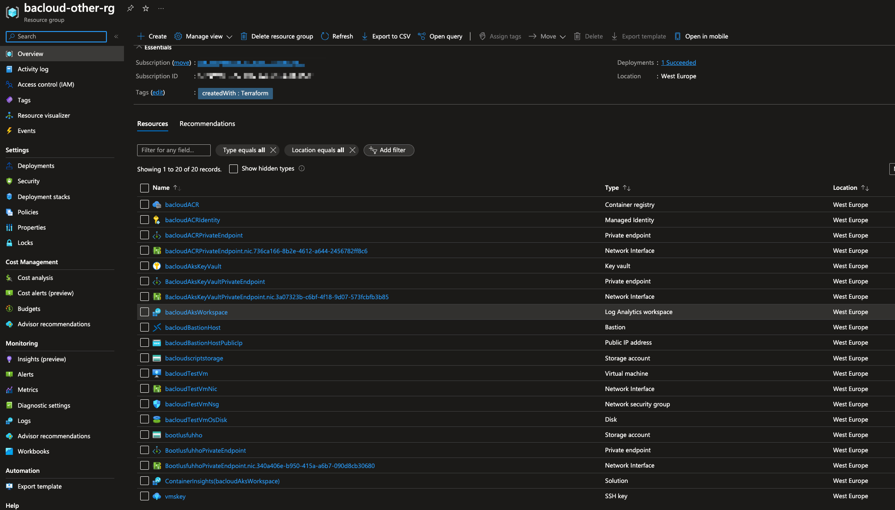

# Azure Kubernetes Service (AKS) with the well architected framework

## Info

Architectural best practices for Azure Kubernetes Service (AKS) with the well architected framework.
In a private AKS cluster, the Kubernetes API server is not exposed to the internet via a public IP address. To manage the cluster, you need to connect to the cluster from a computer or VM that has network access to the cluster's private IP address space. This sample deploys a jumpbox virtual machine in the hub virtual network peered with the virtual network that hosts the private AKS cluster. There are several options for establishing network connectivity to the private cluster.

- Create a virtual machine in the same Azure Virtual Network (VNet) as the AKS cluster.
- Use a virtual machine in a separate network and set up Virtual network peering. See the section below for more information on this option.
- Use an Express Route or VPN connection.

In addition, the sample creates a private endpoint to access all the managed services deployed by the Terraform modules via a private IP address:

- Azure Container Registry
- Azure Key Vault
- Azure Storage Account

## Architecture

The following picture provides an overview of the architecture on Azure:

## Requirements

- Create a storage account with a container and upload the script file from /terraform/scripts/configure-jumpbix-vm.sh
  - add the variables of the storage account to variables file:
    - script_storage_account_name
    - script_storage_account_key
- Change the variables according to your needs in the variables file

## Deployment images

### bacloud_aks_hub_resource_group

### bacloud_aks_resource_group

### bacloud_aks_infra_resource_group

### bacloud_other_resource_group

